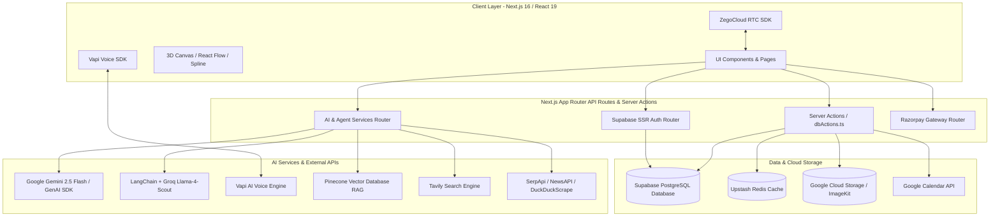

# 🚀 Clario Career Platform - Comprehensive Technical Specification & Compiled Documentation

---

## 1. Executive Summary & Overview

**Clario Career Platform** is an end-to-end, AI-driven career development ecosystem engineered to bridge the gap between individual ambition and market reality. Built for students, job-seeking professionals, and industry mentors, Clario integrates cutting-edge Generative AI, 3D roadmap visualizations, automated voice-based mock interviewing, vector-search powered RAG (Retrieval-Augmented Generation), real-time video conferencing, and automated job application management into a single, cohesive web application.

### 1.1 Core Vision & Mission
- **Vision**: Democratize high-quality, personalized career counseling and mentorship through autonomous AI agents and interactive 3D visualizations.
- **Mission**: Guide individuals step-by-step from career exploration to skill development, interview readiness, mentor networking, and job placement.

### 1.2 Target Audience & Roles
1. **Students & Learners**: High school/college students seeking career path discovery, college selection recommendations, and structured skill roadmaps.
2. **Professionals & Job Seekers**: Working individuals preparing for career transitions, optimizing resumes, tracking job applications, and conducting AI voice mock interviews.
3. **Industry Mentors**: Experts offering 1:1 consultation, mock interview reviews, and career counseling sessions.
4. **Platform Administrators**: Superusers managing credit top-ups, mentor verifications, and platform analytics.

---

## 2. System Architecture

The Clario Career Platform follows a modern, decoupled cloud architecture built on **Next.js 16 (Turbopack)**, **React 19**, **Supabase PostgreSQL**, **Pinecone Vector DB**, **Upstash Redis**, and multiple specialized AI engines.



### 2.1 Technology Stack Details

| Layer | Technologies & Frameworks |
|---|---|
| **Frontend Framework** | Next.js 16.1 (Turbopack), React 19.2, TypeScript 5 |
| **Styling & UI Components** | Tailwind CSS v4, Framer Motion 12, Radix UI Primitives, Lucide React, Styled Components |
| **3D & Canvas Graphics** | `@xyflow/react` (React Flow), `@splinetool/react-spline`, `@react-three/fiber`, Three.js |
| **AI LLMs & Orchestration** | Google Gemini 2.5 Flash (`@google/genai`), LangChain (`@langchain/core`, `@langchain/groq`, `@langchain/google-genai`), Llama-4-Scout |
| **Voice AI & Speech** | `@vapi-ai/web` (Voice Agent Interface) |
| **Search & Web Agents** | `@tavily/core`, SerpApi, NewsAPI, `duck-duck-scrape` |
| **Vector DB & RAG** | `@pinecone-database/pinecone`, Google Generative AI Embeddings (`text-embedding-004`) |
| **Backend & DB** | Supabase (`@supabase/ssr`, `@supabase/supabase-js`), PostgreSQL |
| **Caching** | Upstash Redis (`@upstash/redis`) |
| **Media & Storage** | Google Cloud Storage (`@google-cloud/storage`), ImageKit (`@imagekit/next`) |
| **Real-Time Video** | `@zegocloud/zego-uikit-prebuilt` |
| **Payments** | Razorpay SDK (`razorpay`) |

---

## 3. Comprehensive Feature Set

### 3.1 User Authentication & Role Management
- **OAuth Integration**: Instant login using Google, Discord, and Slack OAuth providers.
- **Email / Password**: Registration with automated email verification and password reset workflows.
- **Role-Based Access Control (RBAC)**: Enforces access bounds between `Student`, `Mentor`, and `Admin` users via `RoleGuard.tsx`.
- **Credit & Pro Subscription System**: User credit balance tracking (`totalCredits`, `remainingCredits`) and Pro status tier management (`isPro`).

### 3.2 AI Career Coach & Conversational Agent
- **Autonomous Multi-Tool Agent**: Built with Gemini 2.5 Flash using continuous function call loop execution (`runAgent` in `Agents.ts`).
- **Dynamic Tool Execution**:
  - `retrival`: Queries Pinecone Vector DB for contextual career guidance.
  - `tavilySearch`: Executes real-time web searches via Tavily API for job market statistics and live facts.
  - `updateCareerTool`: Dynamically updates the user's target career selection directly in Supabase DB.
- **Personalized Context**: Evaluates user profile, current status, academic stream, quiz results, and career options.

### 3.3 3D Interactive Career Roadmaps & Learning Tracks
- **AI Roadmap Generator (`/api/ai/roadmap-gen`)**: Generates custom interactive node graphs based on target role, timeline (e.g., "3 months"), and skill level (Beginner/Intermediate/Advanced).
- **Multi-Pass LLM Validation**: Employs a 2-stage Llama-4-Scout LLM prompt cycle with `jsonrepair` to produce valid React Flow node/edge structures.
- **Learning Tracks & Checkpoints**: Converts roadmaps into executable tracks containing checkpoints, subtopics, recommended documentation links, and automated YouTube video tutorial search links.

### 3.4 AI Voice Mock Interviews & Proctoring
- **Real-Time Voice AI Agent**: Integrated using Vapi AI for interactive spoken technical and behavioral mock interviews.
- **Interview Security & Proctoring**: Real-time detection of tab switching, window focus loss, attempt count violations, and watermark rendering to ensure test integrity (`Security.ts`, `BlockScreen.tsx`, `watermark.tsx`).
- **Automated Performance Analysis**: Evaluates student responses across technical skills, communication clarity, problem-solving skills, and experience level to generate detailed feedback scores.

### 3.5 Mentor Connect & Real-Time Video Call
- **Smart Mentor Matching**: Algorithmic match scoring based on career target alignment, exact position match, and related field mappings (`dbActions.ts` -> `getAllMentorsPaginated`).
- **Real-Time 1:1 Video Calls**: Powered by ZegoCloud UIKit (`room/[roomid]`).
- **Session Scheduling**: Supports booking 10-min, 30-min, or 45-min sessions with calendar integration and notification triggers.

### 3.6 Job Application Tracker
- **Kanban Application Tracking**: Manage job search pipeline stages: `saved`, `applied`, `interviewing`, `negotiating`, `hired`, `rejected`.
- **Application Analytics**: Tracks job titles, companies, application dates, job types (full-time, internship, contract), and personal interview notes.

### 3.7 AI Resume Builder
- **Multi-Section Editor**: Dynamic forms for Bio, Experience, Education, Projects, Skills, and Custom Sections (`EditorSidebar`).
- **ATS Optimization**: Generates resume layouts designed for Applicant Tracking System compatibility (`ResumePreviewOne`, `TemplateOne`).

### 3.8 Smart College Suggestions
- **Data-Driven College Recommendations**: Matches students with institutions based on normalized degree choices, geographic locations (state/city), fees, and placement metrics (`getSuggestedCollegeData`).

---

## 4. Database Schema & Data Models

### 4.1 Supabase PostgreSQL Database Tables

#### `users` Table
```sql
CREATE TABLE users (
  id BIGINT PRIMARY KEY GENERATED ALWAYS AS IDENTITY,
  userName TEXT NOT NULL,
  userEmail TEXT UNIQUE NOT NULL,
  avatar TEXT,
  created_at TIMESTAMPTZ DEFAULT NOW(),
  totalCredits INT DEFAULT 100,
  remainingCredits INT DEFAULT 100,
  invite_link TEXT,
  current_status TEXT, -- e.g., 'Student', 'Professional'
  userPhone TEXT,
  institutionName TEXT,
  mainFocus TEXT,
  calendarConnected BOOLEAN DEFAULT FALSE,
  is_verified BOOLEAN DEFAULT FALSE,
  isQuizDone BOOLEAN DEFAULT FALSE,
  latitude FLOAT,
  longitude FLOAT,
  google_refresh_token TEXT,
  isPro BOOLEAN DEFAULT FALSE
);
```

#### `userQuizData` Table
```sql
CREATE TABLE userQuizData (
  id BIGINT PRIMARY KEY GENERATED ALWAYS AS IDENTITY,
  created_at TIMESTAMPTZ DEFAULT NOW(),
  quizInfo JSONB NOT NULL,
  userId TEXT NOT NULL,
  user_current_status TEXT,
  user_mainFocus TEXT,
  userName TEXT,
  userAvatar TEXT,
  selectedCareer TEXT
);
```

#### `mentors` Table
```sql
CREATE TABLE mentors (
  id UUID PRIMARY KEY DEFAULT gen_random_uuid(),
  full_name TEXT NOT NULL,
  email TEXT UNIQUE NOT NULL,
  phone TEXT,
  linkedin TEXT,
  bio TEXT,
  expertise TEXT[],
  current_position TEXT NOT NULL,
  availability BOOLEAN DEFAULT TRUE,
  rating FLOAT DEFAULT 5.0,
  avatar TEXT,
  created_at TIMESTAMPTZ DEFAULT NOW(),
  is_verified BOOLEAN DEFAULT FALSE,
  video_url TEXT
);
```

#### `mentor_sessions` Table
```sql
CREATE TABLE mentor_sessions (
  id UUID PRIMARY KEY DEFAULT gen_random_uuid(),
  mentor_id UUID REFERENCES mentors(id),
  student_id TEXT NOT NULL,
  session_type TEXT CHECK (session_type IN ('10 min session', '30 min session', '45 min session')),
  status TEXT CHECK (status IN ('pending', 'accepted', 'rejected', 'completed')),
  requested_at TIMESTAMPTZ DEFAULT NOW(),
  scheduled_at TIMESTAMPTZ,
  completed_at TIMESTAMPTZ,
  notes TEXT,
  vc_link TEXT,
  reviews TEXT,
  mentorName TEXT,
  mentorAvatar TEXT
);
```

#### `colleges` Table
```sql
CREATE TABLE colleges (
  id UUID PRIMARY KEY DEFAULT gen_random_uuid(),
  college_name TEXT NOT NULL,
  location TEXT NOT NULL,
  best_suit_for TEXT[],
  fees TEXT,
  placement TEXT,
  type TEXT
);
```

#### `job_tracker` Table
```sql
CREATE TABLE job_tracker (
  id BIGINT PRIMARY KEY GENERATED ALWAYS AS IDENTITY,
  created_at TIMESTAMPTZ DEFAULT NOW(),
  userId TEXT NOT NULL,
  stage TEXT CHECK (stage IN ('saved', 'applied', 'interviewing', 'negotiating', 'hired', 'rejected')),
  job_title TEXT NOT NULL,
  company TEXT NOT NULL,
  applied_date TEXT,
  type TEXT CHECK (type IN ('full-time', 'internship', 'contract', 'freelance', 'part-time')),
  description TEXT,
  note TEXT
);
```

#### `user_calendar_events` Table
```sql
CREATE TABLE user_calendar_events (
  id UUID PRIMARY KEY DEFAULT gen_random_uuid(),
  user_id TEXT NOT NULL,
  title TEXT NOT NULL,
  start_time TIMESTAMPTZ NOT NULL,
  end_time TIMESTAMPTZ NOT NULL,
  google_event_id TEXT,
  created_at TIMESTAMPTZ DEFAULT NOW(),
  updated_at TIMESTAMPTZ DEFAULT NOW()
);
```

---

## 5. API Integration & Endpoints Directory

### 5.1 AI & Machine Learning Endpoints

#### `POST /api/ai/roadmap-gen`
- **Description**: Generates 3D node-edge roadmap structure via LangChain and Groq Llama-4-Scout.
- **Request Body**: `{ "field": string, "timeline": string, "mode": string }`
- **Response**: `{ roadmapTitle: string, description: string, duration: string, initialNodes: Array, initialEdges: Array }`

#### `POST /api/ai/generate-checkpoint`
- **Description**: Generates checkpoint breakdown and subtopics for a selected learning roadmap track.

#### `POST /api/ai/mocktest/generate-questions`
- **Description**: Creates tailored interview questions based on user's checkpoint skills and career track.

#### `POST /api/ai/mocktest/security`
- **Description**: Validates test security events (e.g. tab focus changes) and logs proctoring flags.

#### `POST /api/ai/qna-generate`
- **Description**: Generates targeted questions & exemplary answers for career field review.

#### `POST /api/ai/quiz-feedback`
- **Description**: Computes detailed AI feedback and score breakdown for completed quizzes and interviews.

#### `POST /api/tavily`
- **Description**: Server-side proxy for executing Tavily web searches to prevent API key exposure on the client.

#### `POST /api/vector/upload`
- **Description**: Generates text embeddings via Google `text-embedding-004` and upserts them into Pinecone Vector DB.

---

### 5.2 Calendar & Integration Endpoints

#### `GET /api/google/connect`
- **Description**: Initiates Google OAuth consent flow for Google Calendar scope access.

#### `GET /api/google/callback`
- **Description**: Handles OAuth redirect callback, exchanges authorization code for refresh tokens, and persists token in `users` table.

#### `POST /api/google/sync`
- **Description**: Synchronizes platform sessions and events directly to the user's Google Calendar account.

---

### 5.3 Payment & Media Endpoints

#### `POST /api/razorpay/create-order`
- **Description**: Instantiates Razorpay order for pro subscription upgrades or credit top-ups.

#### `POST /api/razorpay/verify-payment`
- **Description**: Validates HMAC SHA256 signature of Razorpay payments and credits user account.

#### `POST /api/gcp-upload` & `POST /api/upload-auth`
- **Description**: Authenticates and uploads user assets (resumes, avatars, recordings) to Google Cloud Storage / ImageKit.

---

## 6. Core Function Directory (`src/lib/functions`)

### 6.1 `dbActions.ts` (Server Actions)

| Function Name | Return Type | Description |
|---|---|---|
| `getMatchingMentors(userMainFocus)` | `Promise<DBMentor[]>` | Returns top-rated mentors matching user's main career focus. |
| `getAllMentorsPaginated(page, limit, userCareer)` | `Promise<PaginatedMentors>` | Returns paginated mentors ordered by career relevance score. |
| `getRandomUsersByInstitution(instName, curId)` | `Promise<DBUser[]>` | Fetches peer connections from the same institution. |
| `getRandomUsersByCareer(career, curId)` | `Promise<UserQuizData[]>` | Fetches peer profiles sharing the same target career choice. |
| `getUserQuizData(userId)` | `Promise<UserQuizData[]>` | Retrieves stored quiz results and profile metadata for a user. |
| `getSuggestedCollegeData(degrees, state)` | `Promise<College[]>` | Filters and matches colleges based on degree specialization and state/city. |
| `getSelectedCareer(userId)` | `Promise<string \| null>` | Returns the currently selected career path for a user. |
| `updateSelectedCareer(userId, selectedCareer)` | `Promise<string \| null>` | Updates the user's active target career choice in `userQuizData`. |
| `paginatedColleges(page, limit, location, type)` | `Promise<College[]>` | Returns filtered paginated college records. |
| `getReviewsByMentorId(mentorId)` | `Promise<any[]>` | Retrieves past student reviews for a given mentor. |
| `triggerSessionNotification(data)` | `Promise<void>` | Dispatches session booking notification alerts. |

---

### 6.2 `Agents.ts` (AI Agent Execution)

| Function Name | Return Type | Description |
|---|---|---|
| `runAgent(ctx: AgentContext)` | `Promise<string>` | Main execution loop for the AI Career Coach agent using Gemini 2.5 Flash and function tools. |
| `tavilySearch(query)` | `Promise<string>` | Executes web search via `/api/tavily` endpoint. |
| `retrival(userQuery)` | `Promise<string>` | Conducts semantic vector search over Pinecone vector database. |

---

### 6.3 Vector & Search Pipeline Functions

| File | Primary Functions | Purpose |
|---|---|---|
| `embedding.ts` | `generateEmbeddings(text)` | Uses Google GenAI `text-embedding-004` to create vector embeddings. |
| `pineconeQuery.ts` | `retrivalServer(query)` | Queries Pinecone index with text embeddings and returns matched metadata text. |
| `tavily.ts` | `tavilySearching(query)` | Invokes Tavily Core client for real-time web research. |
| `google-calendar.ts` | `createGoogleCalendarEvent(...)` | Interfaces with `googleapis` Calendar API to schedule sessions. |

---

## 7. Frontend Pages & Route Mapping

| Route | Main Component File | Feature Description |
|---|---|---|
| `/` | `app/page.tsx` | Platform Landing Page with hero visualizers, feature highlights, and call to action. |
| `/auth` | `app/auth/page.tsx` | User Login & Registration page (Email/Password & Social OAuth). |
| `/home` | `app/(main)/home/page.tsx` | Main Student Dashboard showing roadmaps, daily schedule, credits, and AI suggestions. |
| `/home/ai-tools/career-coach` | `app/(main)/home/ai-tools/career-coach/page.tsx` | Interactive chat interface with the Gemini 2.5 Flash AI Career Coach. |
| `/home/ai-tools/roadmap-maker` | `app/(main)/home/ai-tools/roadmap-maker/page.tsx` | 3D Interactive React Flow / Spline roadmap visualizer and generator. |
| `/home/ai-tools/resume-maker` | `app/(main)/home/ai-tools/resume-maker/page.tsx` | Multi-section ATS-friendly AI Resume Builder and PDF generator. |
| `/home/interview-prep` | `app/(main)/home/interview-prep/page.tsx` | AI Voice Mock Interview launchpad powered by Vapi AI. |
| `/home/mentor-connect` | `app/(main)/home/mentor-connect/page.tsx` | Mentor directory, search filtering, and 1:1 session booking. |
| `/room/[roomid]` | `app/room/[roomid]/page.tsx` | ZegoCloud video call room for student-mentor 1:1 sessions. |
| `/home/job-tracker` | `app/(main)/home/job-tracker/page.tsx` | Kanban-style job application stage tracker. |
| `/home/my-tracks` | `app/(main)/home/my-tracks/page.tsx` | Active user learning tracks, checkpoint progress, and quiz challenges. |
| `/dashboard` | `app/(mentor-main)/dashboard/page.tsx` | Dedicated Mentor Dashboard for session requests, earnings, and video calls. |

---

## 8. Summary of Uses & How to Run

### 8.1 Setup Instructions
1. **Clone & Navigate**:
   ```bash
   git clone https://github.com/ronitrai27/clario-career_platform.git
   cd clario-career_platform/clario-career-platform
   ```
2. **Install Dependencies**:
   ```bash
   pnpm install
   ```
3. **Configure Environment Variables (`.env.local`)**:
   ```env
   NEXT_PUBLIC_GEMINI_API_KEY=your_gemini_api_key
   GROQ_API_KEY=your_groq_api_key
   NEXT_PUBLIC_SUPABASE_URL=your_supabase_url
   NEXT_PUBLIC_SUPABASE_ANON_KEY=your_supabase_anon_key
   PINECONE_API_KEY=your_pinecone_api_key
   TAVILY_API_KEY=your_tavily_api_key
   VAPI_API_KEY=your_vapi_api_key
   NEXT_PUBLIC_ZEGO_APP_ID=your_zego_app_id
   NEXT_PUBLIC_ZEGO_SERVER_SECRET=your_zego_server_secret
   RAZORPAY_KEY_ID=your_razorpay_key_id
   RAZORPAY_KEY_SECRET=your_razorpay_key_secret
   ```
4. **Run Development Server**:
   ```bash
   pnpm dev
   ```
   Access at `http://localhost:3000`.

---
*Document Compiled Automatically for **`clario-career_platform`**.*
